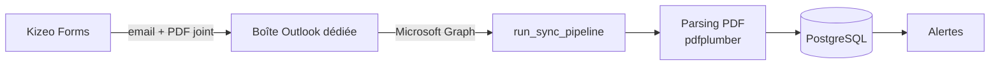
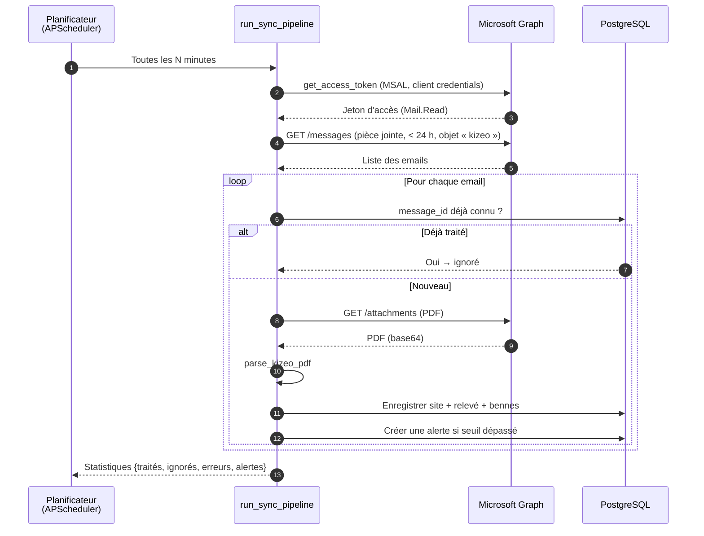
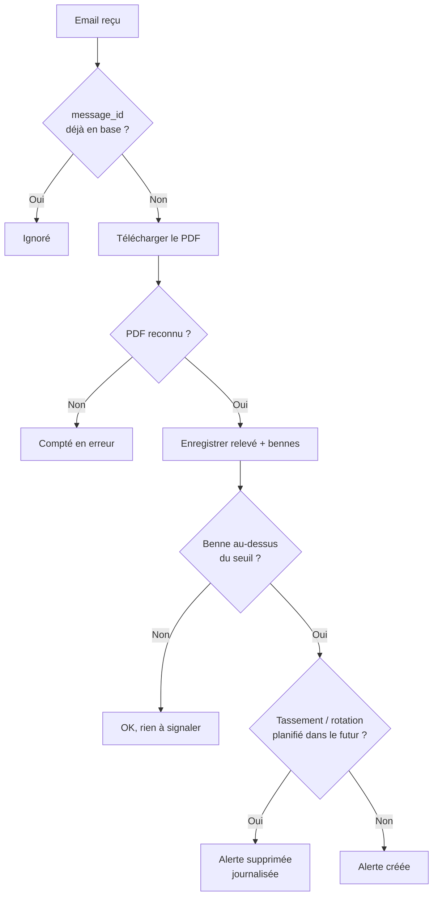

# Automatisation de la récupération des PDF depuis la boîte mail

Ce document explique, étape par étape, comment l'application **récupère
automatiquement** les rapports PDF envoyés par **Kizeo Forms** par email, puis les
importe en base de données.

---

## Vue d'ensemble

```
Kizeo Forms → email (PDF joint) → Boîte Outlook dédiée
                                         │
              (Microsoft Graph, toutes les N minutes)
                                         ▼
   Planificateur ──► run_sync_pipeline ──► parsing PDF ──► PostgreSQL ──► alertes
```

> L'application ne « surveille » pas la boîte en continu : elle **interroge**
> Microsoft Graph à intervalle régulier (*polling*).

---

## Diagrammes

> 💡 Ces diagrammes utilisent **Mermaid**. Dans VS Code, l'aperçu markdown
> (`Ctrl+Shift+V`) les affiche graphiquement avec l'extension *Markdown Preview Mermaid
> Support*. Ils s'affichent aussi nativement sur GitHub.

### Flux général



### Diagramme de séquence (le polling en détail)



### Logique de décision pour chaque email



---

## Étape 0 — Le déclenchement

Deux portes d'entrée, mais **le même pipeline** derrière :

- **Automatique** : un planificateur **APScheduler** (dans `backend/main.py`,
  fonction `_job_synchronisation`) exécute la synchronisation toutes les
  `SYNC_INTERVAL_MINUTES`. Il ne démarre **que** si `SYNC_ENABLED=true` **et** que la
  configuration Azure/Outlook est complète.
- **Manuel** : bouton « Synchroniser » → `POST /sync/manual`
  (`backend/routers/sync.py`), réservé aux administrateurs.

Les deux appellent la fonction **`run_sync_pipeline`** (`backend/services/ingestion.py`).

---

## Étape 1 — Authentification à Microsoft Graph

Fichier : `backend/services/graph_watcher.py` → `get_access_token`

- Flux **client credentials** (mode application, **sans utilisateur interactif**) via la
  librairie **MSAL**.
- Utilise `AZURE_TENANT_ID`, `AZURE_CLIENT_ID`, `AZURE_CLIENT_SECRET` pour obtenir un
  **jeton d'accès** avec le scope `.default` (les permissions accordées à l'application,
  ici **`Mail.Read`**).

---

## Étape 2 — Récupération des emails

Fichier : `graph_watcher.py` → `fetch_kizeo_emails`

- Appel `GET /users/{OUTLOOK_USER_EMAIL}/messages` sur Microsoft Graph.
- **Filtre côté serveur** : emails avec pièce jointe (`hasAttachments eq true`) et reçus
  dans une **fenêtre de 24 h** (`receivedDateTime ge ...`).
- **Filtre métier côté code** : on ne conserve que les emails dont l'objet contient
  « **kizeo** » ou « **etat des lieux** » → le reste de la boîte est ignoré.

---

## Étape 3 — Téléchargement du PDF

Fichier : `graph_watcher.py` → `download_pdf_attachment`

- Appel `GET /messages/{id}/attachments`.
- On cherche la pièce jointe de type `application/pdf`.
- Son contenu arrive encodé en **base64** (`contentBytes`) → décodé en octets bruts,
  prêts à être analysés.

---

## Étape 4 — Lecture du PDF

Fichier : `backend/services/pdf_parser.py` → `parse_kizeo_pdf`

- **pdfplumber** extrait le texte du PDF.
- Détection des champs (déchèterie, date, agent) et des lignes de bennes
  (type de déchet + taux de remplissage %).
- Renvoie un objet structuré `ReleveData`, ou `None` si le PDF n'est pas reconnu
  (sans planter le traitement).

---

## Étape 5 — Déduplication, persistance et alertes

Toujours dans `run_sync_pipeline`, pour chaque email :

1. **Déduplication** : on vérifie si le `message_id` de l'email existe déjà en base
   (`Releve.email_message_id`). Si oui → **ignoré**. C'est ce qui rend le *polling*
   fréquent **sans risque de doublon**, même si on repasse plusieurs fois sur la même
   fenêtre de 24 h.
2. **Persistance** : création/mise à jour du **site** (déchèterie), du **relevé** et des
   **bennes** avec leurs taux.
3. **Coupe-circuit d'alerte** : si une benne dépasse son seuil **et** qu'aucun
   tassement/rotation n'est planifié dans le futur → une alerte est créée ; sinon
   l'alerte est supprimée (et simplement journalisée).
4. La fonction renvoie des **statistiques** : `{traités, ignorés, erreurs, alertes}`,
   affichées dans l'interface de synchronisation.

---

## Configuration (fichier `.env`)

```dotenv
AZURE_TENANT_ID=...          # accès Microsoft Graph
AZURE_CLIENT_ID=...
AZURE_CLIENT_SECRET=...
OUTLOOK_USER_EMAIL=...       # la boîte mail dédiée à interroger

SYNC_ENABLED=true            # active le planificateur automatique
SYNC_INTERVAL_MINUTES=5      # fréquence du polling (5 min recommandé)
```

---

## Points clés à retenir

- **Polling, pas push** : approche simple et fiable (détails côté infra dans
  `docs/integration-email.md`).
- **Idempotent** : la déduplication par `message_id` garantit qu'un même email n'est
  jamais traité deux fois.
- **Lecture seule + moindre privilège** : l'application ne fait que **lire**
  (`Mail.Read`), sur une seule boîte ; la purge des mails est gérée par Exchange
  (stratégie de rétention), pas par l'application.
- **Tolérant aux pannes** : un PDF illisible ou un email sans pièce jointe est compté en
  « erreur » sans interrompre le traitement des autres emails.
- **Deux modes, un seul pipeline** : automatique (planificateur) et manuel (bouton
  admin) partagent exactement le même traitement.

> 💡 Le même parseur sert aussi à l'**import manuel de PDF** (onglet « Importer PDF »), à
> une nuance près : la déduplication s'y fait par **empreinte SHA-256** du fichier au lieu
> du `message_id` de l'email.
